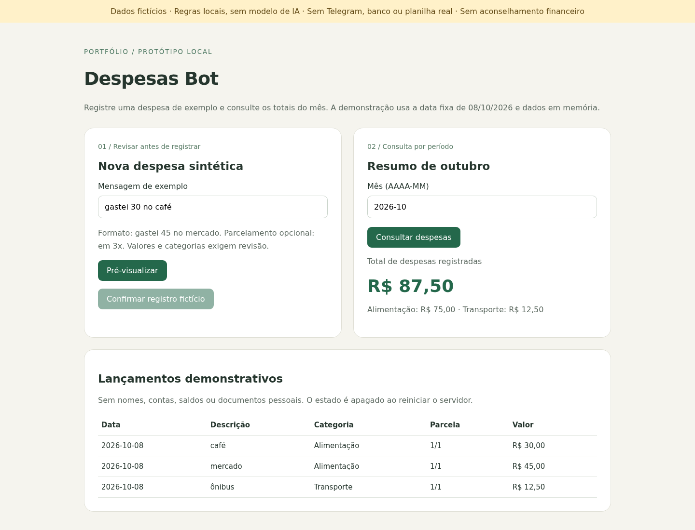

# Despesas Bot

A small local demonstration of recording and consulting expenses in Brazilian Portuguese. It adapts category rules from an original AI Financial Manager bot, while replacing live integrations with a synthetic, review-first workflow.

**This release uses deterministic rules, not an AI model. No Telegram, Google Sheets, bank account, external logging or investment advice is included. Use invented data only.** It is not the original deployed service and does not claim automatic financial management.



## What it demonstrates

- Restricted expense input: `gastei 45 no mercado` or `gastei 10 no livro em 3x`.
- Keyword category matching adapted from the original bot. Unknown descriptions become `Outros` and need review.
- Preview before confirming a fictitious entry. Editing input disables the old confirmation.
- Integer-cent amounts and installment splitting with a preserved total and month-end handling.
- Monthly totals, category totals and a list of recorded expenses.
- Request identifiers prevent repeat confirmation of the same local request.

The date is frozen at **2026-10-08** for repeatable demonstrations. Seeds are invented: R$ 45,00 at a market and R$ 12,50 on a bus. The screenshot adds a confirmed R$ 30,00 coffee example, for a total of R$ 87,50. These are not anyone's financial records.

## Run locally

Python 3.10 or newer. No third-party package or credential is required.

```bash
python3 -m app.server
```

Open `http://127.0.0.1:8001`. Preview an example, review the proposed category/value/installments, confirm the fictitious record, then consult `2026-10`.

The server binds only to loopback. All ledger data is held in an in-memory SQLite database and resets on restart. Do not expose it as a shared service. No authentication or ownership isolation exists.

## Tests and architecture

```bash
python3 -m unittest discover -s tests -v
```

20 unit/API tests passed locally on Linux and Python 3.10. They cover currency parsing, invalid/ambiguous messages, categories, installment sum and date boundaries, period filtering, idempotence, preview without writing, request shape and foreign-Origin rejection. Actual Chromium smoke verified preview, confirmation, monthly total and reload. Other systems, Telegram, providers and GitHub CI are not tested.

- `app/rules.py`: adapted original normalization and category matching.
- `app/expenses.py`: restricted parser, cent arithmetic, installment schedule and synthetic ledger.
- `app/server.py`: local standard-library HTTP server and JSON routes.
- `app/index.html`: review/confirm UI; returned text is inserted with `textContent`, not raw HTML.

## Privacy and limits

See [privacy review](docs/privacy-review.md). The candidate excludes pickle sessions, chat/user identifiers, service-account files, keys, private endpoints, original logs and all git history. No original finance data is included and no pickle was loaded to prepare the demo.

This is a narrow rules-based prototype. It cannot interpret arbitrary language, photos, receipts, voice messages, bank statements, incomes, balances or investments. Ambiguous amounts and descriptions with numbers are rejected instead of guessed. It has no financial advice, model-quality evaluation or measured productivity claim.

The loopback binding, input limits and Origin check reduce demo exposure but are not authentication or a security certification. Anyone able to reach the server can inspect/change its synthetic state. Python's basic HTTP server is not a production service. There is no audit trail, durable backup, multi-user isolation, rate limiting or retention system beyond restart reset. Request IDs prevent repeat submissions, not semantic duplicates entered under a new ID.

Before a real pilot, define identity/ownership, consent, retention/deletion, encryption, access boundaries, deduplication policy and provider data handling. Do not paste personal data into this demo.

## License

MIT. See [LICENSE](LICENSE).
